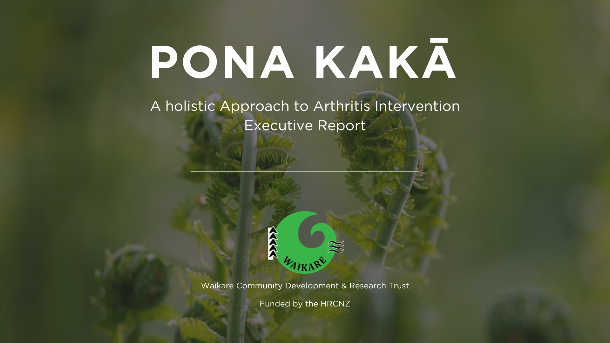

# Pona Kakā Data Analysis Project
 

***Please Note:*** *While my involvement and all project deliverables are complete, the final report has not yet been submitted to the funder, nor have the findings been shared with the participants. Until then, I am unable to share any findings, "Contents" items, or full details of the project. Estimated completion date - December 2024.*

 

**Welcome to the Pona Kakā Data Analysis Repository**

This repository contains my data analysis for the Pona Kakā Initiative, a culturally relevant intervention aimed at managing arthritis within Māori communities. Conducted on behalf of the Waikare Community Development and Research Trust and funded by the Health Research Council of New Zealand (HRCNZ), this project involved analyzing both qualitative and quantitative data to uncover insights into participants' experiences, health outcomes, and the overall impact of the program.

 

**Project Overview**

The Pona Kakā initiative is focused on improving the lives of Māori individuals with arthritis through holistic health practices and community engagement. This analysis supports the initiative by providing actionable insights from the participant data gathered through interviews, helping guide future decisions and program improvements.

 

**Contents**
1. **Project Workflow Outline:** Developed a detailed Word document outlining the project's objectives, proposed workflow, and key deliverables, serving as a roadmap for the analysis process.

2. **Qualitative Data Analysis:** Conducted an in-depth review of interview transcripts to extract participants' experiences, identifying key themes and converting them into structured, quantifiable insights for further analysis.

3. **Data Categorization and Summarization:** Utilized Excel to systematically organize interview data by categorizing responses into relevant themes such as pain duration and treatment types, creating a clear and comprehensive dataset for analysis.

4. **Initial Summary of Insights Report:** Created and delivered an Initial Summary of Insights Report for the project lead, summarizing key findings and highlighting early themes. This report provided a preliminary overview of the data to guide further analysis and decision-making.

5. **Quantitative Data Analysis with Python:** Created, prepared, and analyzed a CSV file using Python to compute descriptive statistics, identify trends, and generate visualizations that highlight key insights from the data.

6. **Report Creation and Presentation:** Synthesized qualitative and quantitative findings into a cohesive final report, designed in Canva. The report effectively communicates the project's impact on the Māori community, ensuring clarity and accessibility for non-technical stakeholders.

 

**Conclusion**
The Pona Kakā Data Analysis Project provides valuable insights that support the continued success and expansion of this culturally significant initiative. Through data-driven recommendations, this project aims to ensure the long-term well-being of participants and their communities.

 

***License:*** *All rights reserved. No part of this repository may be reproduced, distributed, or transmitted in any form or by any means, including photocopying, recording, or other electronic or mechanical methods, without the prior written permission of the owner.*
